# ZoneForge Development Kanban Board

## Sprint Structure Overview

This kanban board follows a 2-week sprint model across the 12-month development roadmap.

- **Phase 1**: Months 1-3 (6 sprints) - Core Editor + SpacetimeDB Foundation
- **Phase 2**: Months 4-6 (6 sprints) - Combat + Server Authority
- **Phase 3**: Months 7-9 (6 sprints) - Advanced Features + Scaling
- **Phase 4**: Months 10-12 (6 sprints) - Multiplayer Features (Future)

---

## Phase 1: Core Editor + SpacetimeDB Foundation

### Month 1 - Sprints 1-2: Foundation

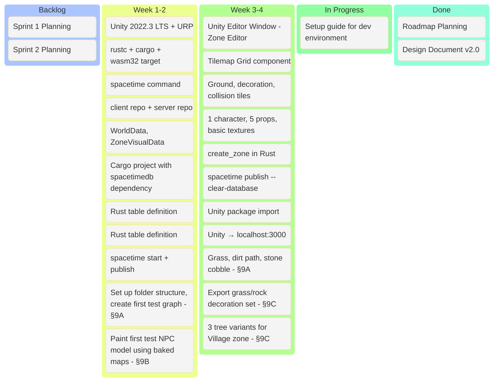

### Month 2 - Sprints 3-4: Entity System + Real-Time Sync

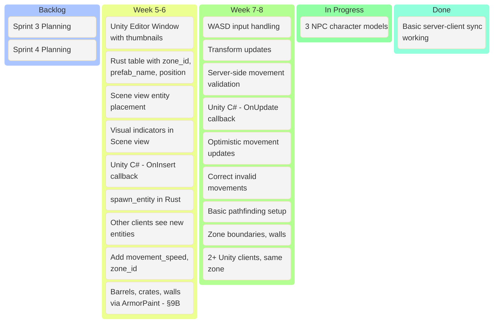

### Month 3 - Sprints 5-6: Triggers and Multiplayer Playtest

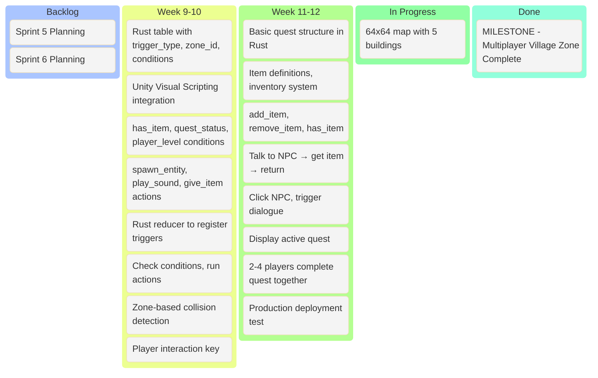

---

## Phase 2: Combat + Server Authority

### Month 4 - Sprints 7-8: Combat Foundation

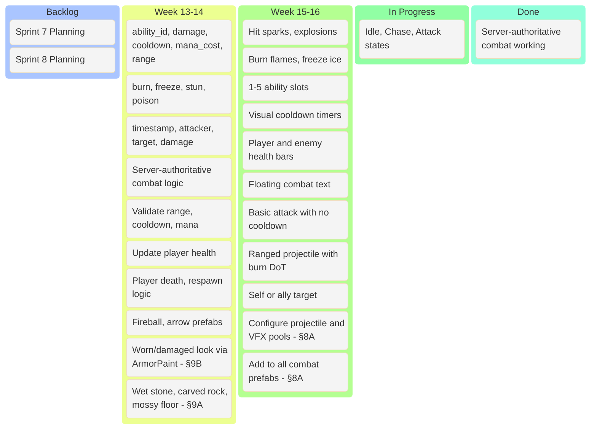

### Month 5 - Sprints 9-10: Zone Stitching + Cloud Deployment

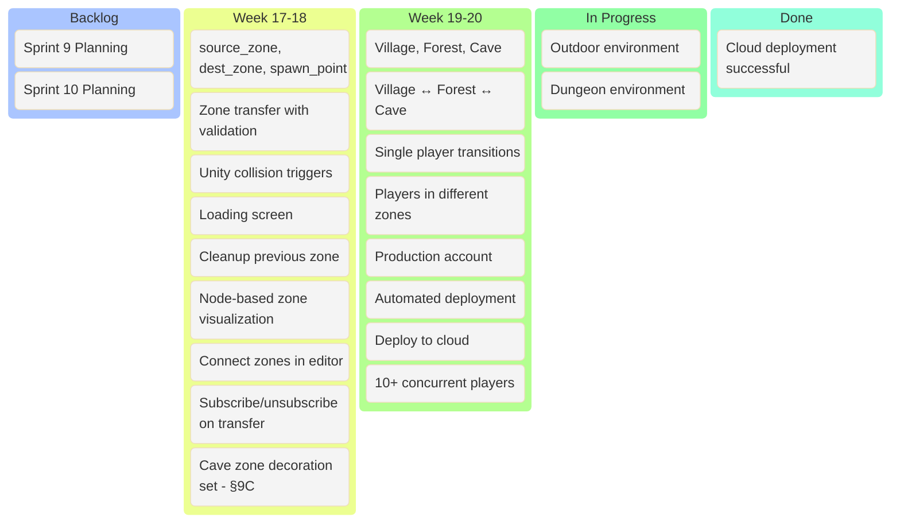

### Month 6 - Sprints 11-12: Systems Polish + Inventory

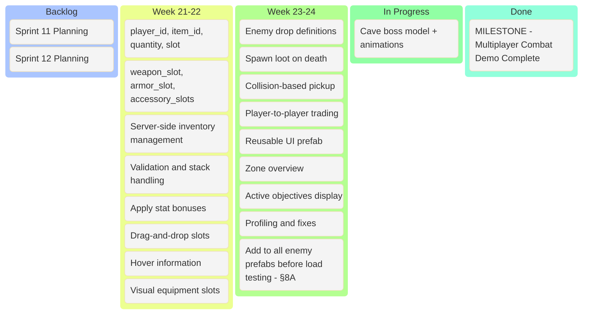

---

## Phase 3: Advanced Features + Scaling

### Month 7 - Sprints 13-14: Advanced Triggers + Quests

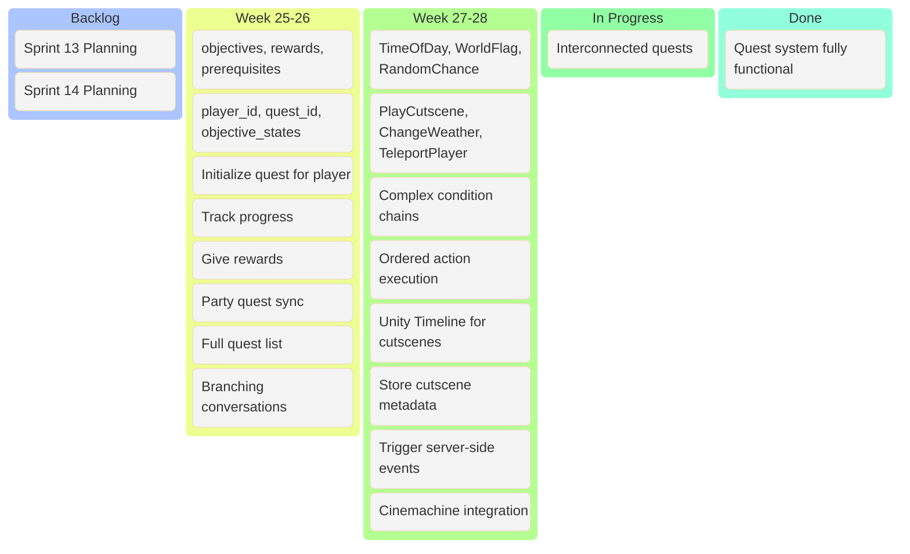

### Month 8 - Sprints 15-16: Interior Builder + Lighting

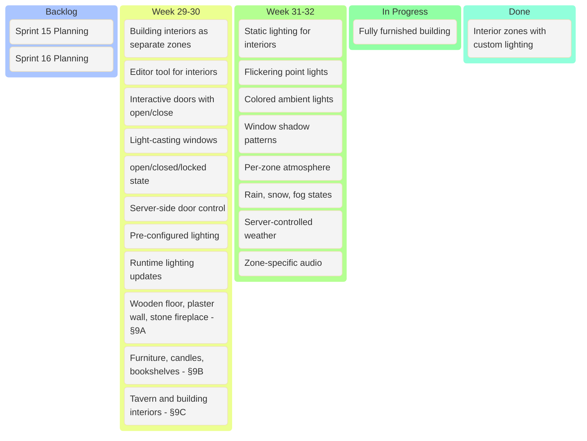

### Month 9 - Sprints 17-18: AI Enhancements + Production Readiness

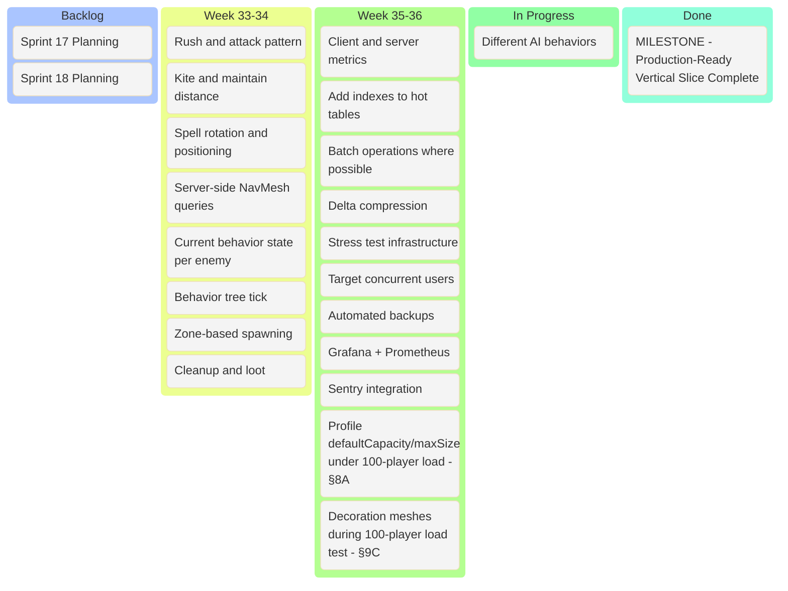

---

## Phase 4: Multiplayer Features (Future Roadmap)

### Month 10 - Sprints 19-20: Party System

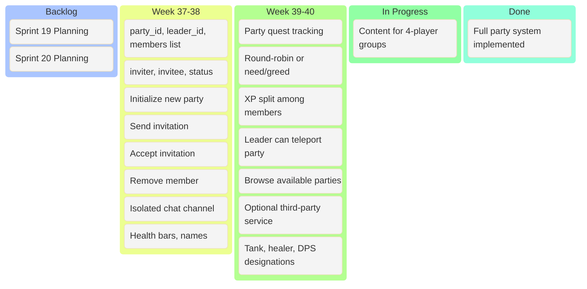

### Month 11 - Sprints 21-22: PvP + Guild System

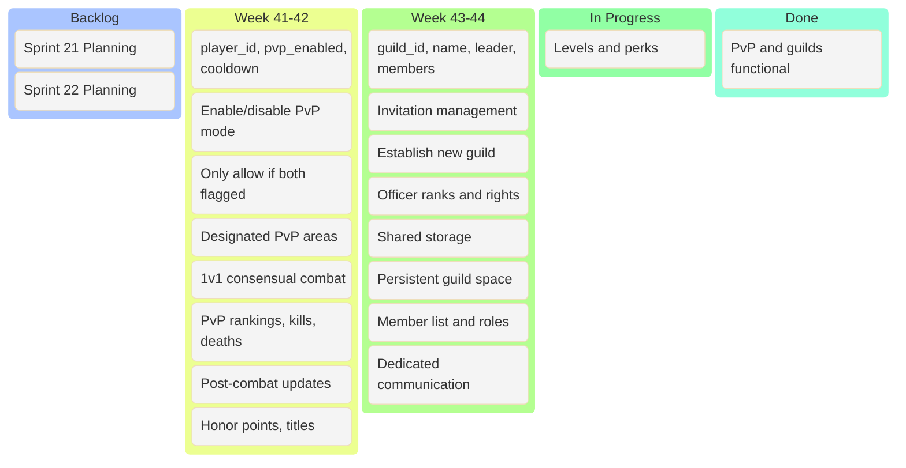

### Month 12 - Sprints 23-24: Economy + World Events

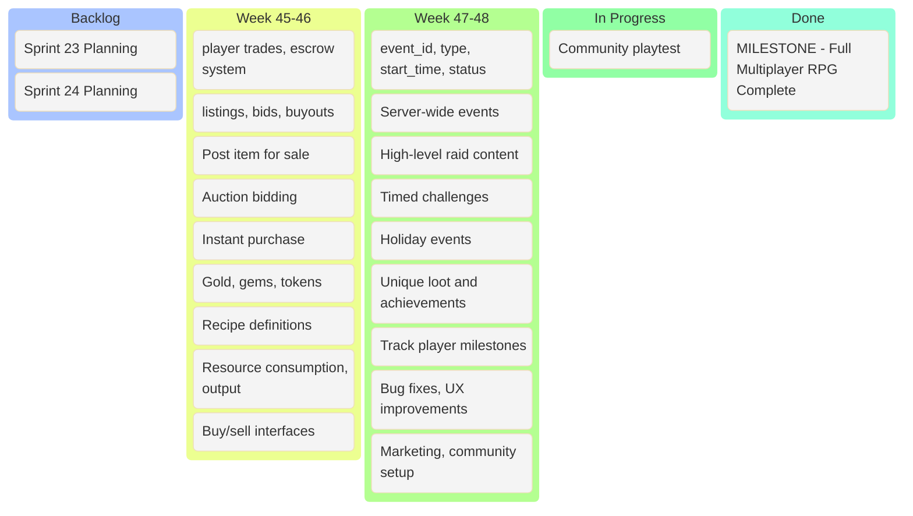

---

## Sprint Velocity Tracking

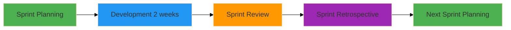

## Risk Board (Ongoing)

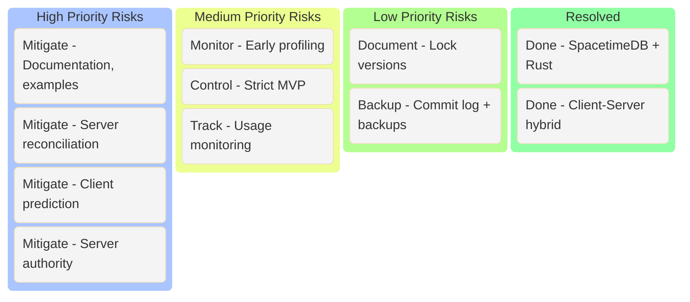

---

## Notes for Obsidian

- Each sprint is 2 weeks (10 working days)
- Use Obsidian's task plugin to track individual items: `- [ ] Task name`
- Link to related docs using `[[Document Name]]` syntax
- Tag sprints with `#sprint-1`, `#sprint-2`, etc.
- Use dataview plugin to query tasks by sprint or phase
- Add daily notes to track progress within sprints

### Example Dataview Query for Current Sprint

```dataview
TASK
WHERE contains(text, "#sprint-3")
GROUP BY file.link
```

### Sprint Board Template for Obsidian

Create a new note for each sprint:

```markdown
---
sprint: 3
phase: 1
start_date: 2026-04-01
end_date: 2026-04-14
tags: [sprint, phase-1, zoneforge]
---

# Sprint 3: Entity System + Real-Time Sync

## Sprint Goal
Implement real-time entity synchronization between Unity client and SpacetimeDB server.

## Tasks
- [ ] Entity Palette Window #sprint-3
- [ ] EntityInstance Table #sprint-3
- [ ] Drag-and-Drop Placement #sprint-3
...
