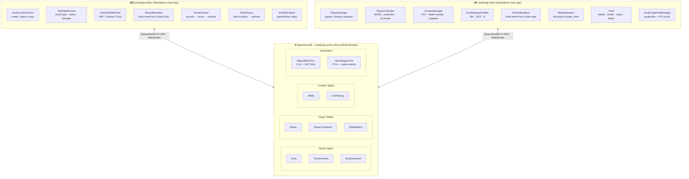
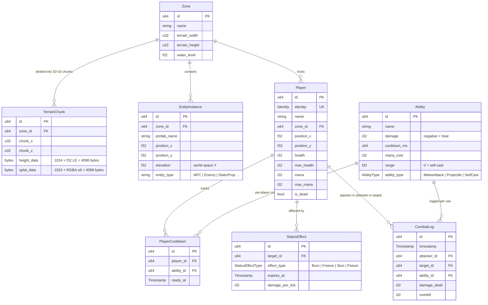
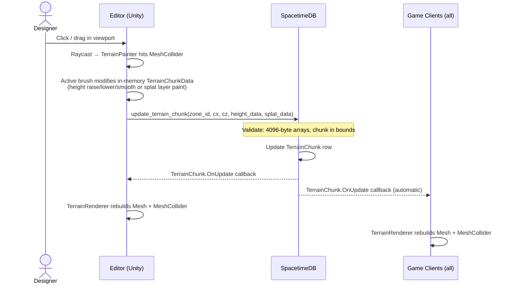
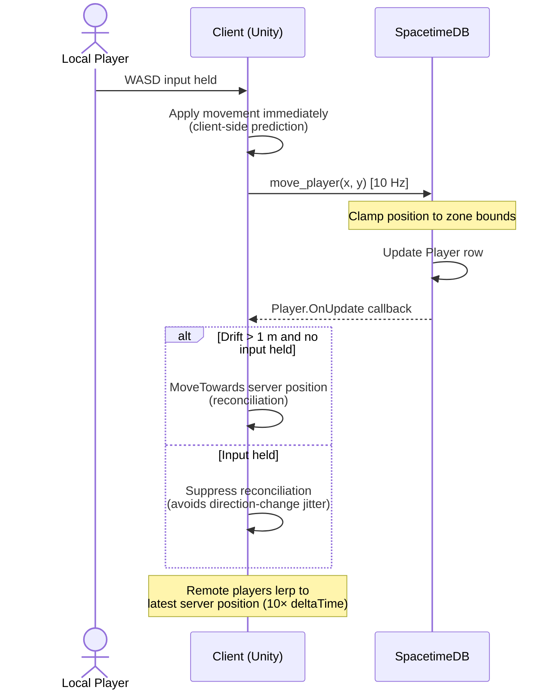
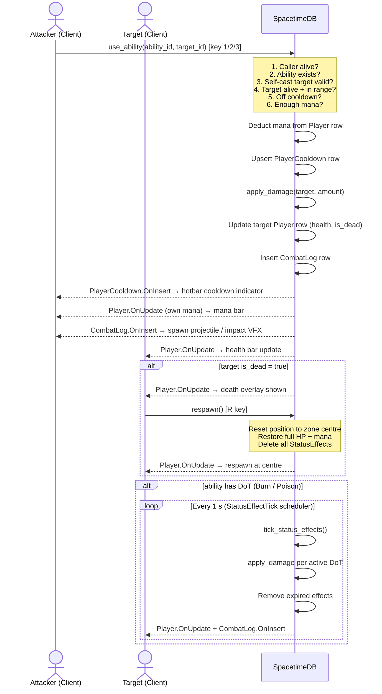
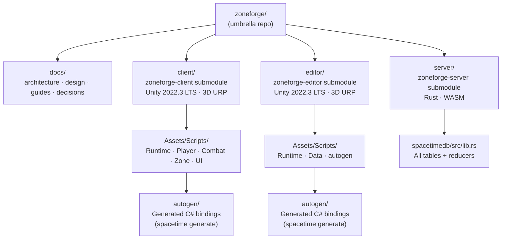

# ZoneForge — Architecture Diagrams

All diagrams use [Mermaid](https://mermaid.js.org/) and render directly on GitHub.

---

## 1. System Architecture

Three standalone applications sharing a single SpacetimeDB backend. The editor writes world data; the game client reads and acts on it. All state changes propagate automatically to every subscriber.

---

## 2. Database Schema

---

## 3. Terrain Editing Workflow

How a brush stroke in the editor propagates to all connected game clients in real time.

---

## 4. Player Movement & Reconciliation

Client-side prediction keeps movement responsive while the server remains authoritative.

---

## 5. Combat Flow

Server-authoritative combat: every check (range, cooldown, mana) happens in the reducer before any state changes.

---

## 6. Project Repository Layout

